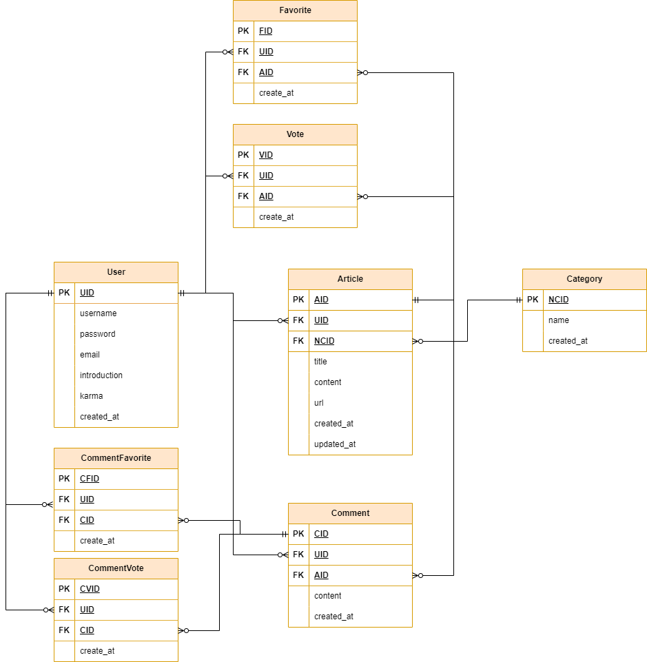

# SpartaNews_ERD

## 프로젝트 소개
    -

## 프로젝트 기능
    - 게시판 (누구나 이용가능)
        - 제목 + 링크
        - 상세내용
        - 투표 수
        - 작성자
        - 시간(1일전...)
        - 댓글 수

    - 게시판 상세(누구나 이용가능)
        - 제목, 링크
        - 투표 수, 작성자
        - 즐겨찾기
        - 댓글 수
        - 상세내용
        - 댓글 목록

    - 댓글(로그인한 사람)
        - 작성자
        - 시간

    - 로그인, 로그아웃
        - 회원가입
            -> 이용 가이드 노출

    - 회원 정보 수정
        - 아이디 노출
        - 가입일 노출
        - Karma 노출
        - 소개 수정
        - 비밀번호 재설정
        - 이메일, 인증
        - 작성한 글
        - 작성한 댓글
        - 즐겨찾기한 글

## ERD

## 개발 기간
    2024-09-11 ~ 2024-09-

## 개발 환경 및 사용 기술
    IDE : VSCODE
    Windows 10, 11  ,   MacOS
    Python 3.10.14
    Django 4.2
    django-seed 0.3.1 
    djangorestframework 3.15.2 
    djangorestframework-simplejwt 5.3.1
    
## API